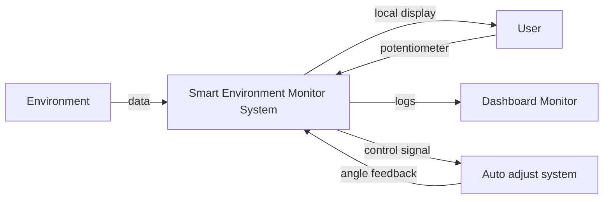
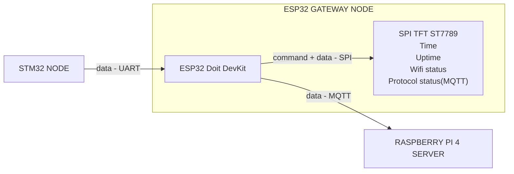
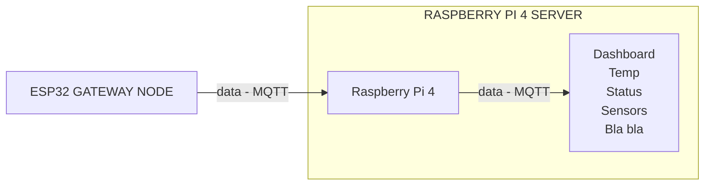
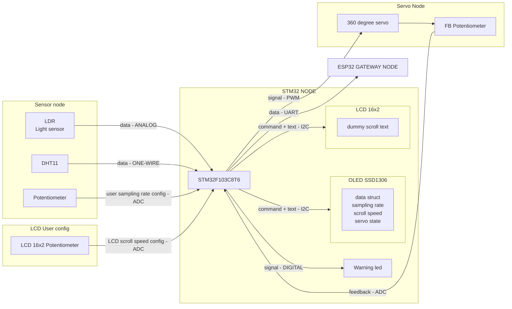

# Architecture Diagrams

## Context Diagram

```mermaid
flowchart LR
    Environment["Environment"]
    User["User"]
    System["Smart Environment Monitor System"]
    Dashboard["Dashboard Monitor"]
    Auto["Auto adjust system"]

    Environment -->|data| System
    User -->|potentiometer| System
    System -->|local display| User
    System -->|logs| Dashboard
    Auto -->|angle feedback| System
    System -->|control signal| Auto
```

## ESP32 Gateway Node

```mermaid
flowchart LR
    STM32["STM32 NODE"]
    RPI4["RASPBERRY PI 4 SERVER"]

    subgraph ESP32GW["ESP32 GATEWAY NODE"]
        ESP32["ESP32 Doit DevKit"]
        SPI["SPI TFT ST7789<br/>Time<br/>Uptime<br/>Wifi status<br/>Protocol status(MQTT)"]
        ESP32 -->|command + data - SPI| SPI
    end

    STM32 -->|data - UART| ESP32
    ESP32 -->|data - MQTT| RPI4
```

## Raspberry Pi 4 Node

```mermaid
flowchart LR
    ESP32GW["ESP32 GATEWAY NODE"]

    subgraph RPI4SRV["RASPBERRY PI 4 SERVER"]
        RPI4["Raspberry Pi 4"]
        Dashboard["Dashboard<br/>Temp<br/>Status<br/>Sensors<br/>Bla bla"]
        RPI4 -->|data - MQTT| Dashboard
    end

    ESP32GW -->|data - MQTT| RPI4
```

## STM32 Node

```mermaid
flowchart LR
    subgraph SensorNode["Sensor node"]
        LDR["LDR<br/>Light sensor"]
        DHT11["DHT11"]
        Pot["Potentiometer"]
    end

    subgraph ServoNode["Servo Node"]
        Servo["360 degree servo"]
        FBPot["FB Potentiometer"]
        Servo --> FBPot
    end

    subgraph LCDUserConfig["LCD User config"]
        LCDPot["LCD 16x2 Potentiometer"]
    end

    subgraph STM32Node["STM32 NODE"]
        STM32["STM32F103C8T6"]

        subgraph OLED["OLED SSD1306"]
            OLEDText["data struct<br/>sampling rate<br/>scroll speed<br/>servo state"]
        end

        subgraph LCD16x2["LCD 16x2"]
            LCDText["dummy scroll text"]
        end

        WarningLed["Warning led"]
    end

    ESP32GW["ESP32 GATEWAY NODE"]

    LDR -->|data - ANALOG| STM32
    DHT11 -->|data - ONE-WIRE| STM32
    Pot -->|user sampling rate config - ADC| STM32
    STM32 -->|signal - PWM| Servo
    FBPot -->|feedback - ADC| STM32
    LCDPot -->|LCD scroll speed config - ADC| STM32
    STM32 -->|command + text - I2C| OLED
    STM32 -->|command + text - I2C| LCD16x2
    STM32 -->|signal - DIGITAL| WarningLed
    STM32 -->|data - UART| ESP32GW
```
